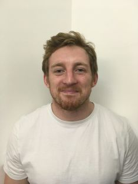

 

 

# BIO
I am a PhD student at the University of Reading who is interested in complex systems, agent-based modelling, and generally making ecology more predictive.

I have set up this website primarly to share code from the R Club and also to spread my bad ideas further and wider than ever before.

 

# RESEARCH INTERESTS 
* Butterflies
* Agent-based modelling
* R programming
* NetLogo
* Movement ecology
* Computational ecology 

For more information on research <a href =https://ibmreading.wordpress.com/butterflies/ > click here <a>
