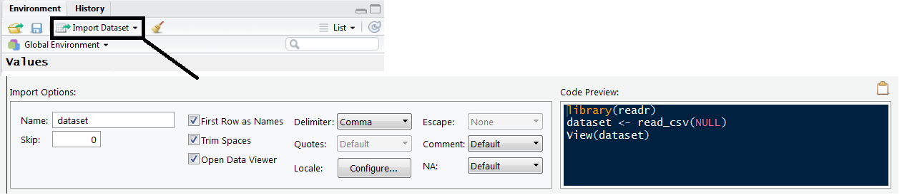

<br/>


<br/>

##Introduction 

<br/>

Successfully getting your dataset into R is like whistling; once you know how, it's hard to imagine finding it difficult, yet presumably at some point it was. It's not my intention to trivialise any possible frustration of the new R user with this analogy, in fact this step seems to be a real hurdle to starting to use R. Rather, I would just like to emphasize that once this first step is overcome it is unlikely to be an issue in the future; so tolerate the brief amount of pain ahead and then we can start doing the interesting stuff. 

This article covers the important processes to get right when getting data in R and then a number of options for developing your own personal data entry scheme. Please note I am purposely avoiding providing the full coverage of all the data types and their associated input methods, I believe this confusion is best avoided at this stage. Instead I hope to provide a bullet-proof, if less than optimal, method for **definitely getting it working**. Hopefully after following this article your data will be sat in R and you will have a reliable method for repeating this process in the future. 

<br/>

##Data preparation 

<br/>

It is usual to have data ready in Excel, or another spreadsheet application, so this will be the starting point. If you have a dataset that cannot be placed into either a spreadsheet or a text file *(i.e. direct from a database)* then abandon this tutorial and <a href= "https://www.datacamp.com/community/tutorials/r-data-import-tutorial#gs.mPSeGAc">use this one</a>. Presuming you have your data ready in excel, the first stage is to clean up the data to remove any elements that R won't like. We'll work from the top down.

**Headers.** Remove all spaces between your column headings and replace with either a **period** or **underscore** . R does in fact normally do this automatically, but it can cause issues so it's prudent to rule it out straight away. This process also provides the opportunity to think about your heading names. I would advise names on the shorter side as, while completing your analysis, you may have to type heading names repeatedly and a long name can quickly grow tiresome; it also has a tendency to make the code look messy. Do not however shorten the names at the risk of forgetting what the heading refers to *(this can happen)*. Finally, remove any symbols: brackets, question marks etc. 

**Blank spaces.** It is also necessary to fill blank spaces in the dataset with "NA". If the dataset is not large then doing this manually is probably easiest and is also an opportunity to scan the dataset for other potential problem elements, like misplaced symbols or forgotten lines of text, which should be removed. If it is a large dataset then using a select and replace tool might be best; I'll leave that to the reader to investigate. The NAs ensure that the columns are read-in as equal in length, so any blank spaces at the bottom of columns must be filled with NAs up to the length of the longest column. 

These changes should resolve just about all the potential issues in the data and so we can move on to creating and saving the correct file type.

<br/>

##File type

<br/>
We will focus on only two file types, *csv* and *txt*. I am also going to proceed with a Windows/Excel bias, though the method is going to be just about the same on any OS. We'll start with the appropriately named Comma-separated value (*csv*) files, which is a file type where, unsurprisingly, the values in the data are separated by commas. You need to save your excel file, which will have the extension *.xls* or *.xlsx*, into a version that has the extension *.csv*. To do this just go to save as and pick *csv* in the 'save as type' box which, when saved, will make a new *csv* version of your file. This file will not look any different in the excel workbook but if opened in a text editor would show the values separated by commas. 

The second route is to use the *.txt* extension, here follow the same procedure as previously described but instead pick text as the extension *(my computer says: 'text (tab delimited)')*. Once you've saved this, you will have a text file version that if opened in a text editor would show the data separated by spaces/tabs. Having generated either one of these files bifurcates the remainder of this article, as the functions you use in the next section are selected based on the file type you just created.

<br/>

##R & RStudio

<br/>

Next we can move the data into R. I'm going to show you 3 ways of doing this if you have RStudio and 2 ways if you're just in R. 

**1)**	The first RStudio exclusive method is to use the *'import Dataset'* button. I have a slight aversion to buttons due to painful memories of time spent searching through menus and sub-menus in complicated software to locate the desired function; but this is a useful feature when you get started. You simply click on it, pick your file type, and then you are provided with a menu where you have options to select the delimiter *(which is what separated the values as explained in the previous section)* and then input a name for the data. This button is simply a GUI for a small amount of code which loads a package and runs a function, which you can see in the *Code preview* box in the menu. 

</br>



</br>

**2)**	I would call this method the 'R way'. Here you write out, and use, the function for yourself; which I think is worth doing over option 1 for a number of reasons. Firstly, once the script file is saved loading the data will be faster the next time. Secondly, you are going to use functions constantly the entire time you are on R so you cannot be uncomfortable with them. Finally, although RStudio's GUI provides lots of options it will never be as flexible as using code. This flexibility is the one of the most important advantages of using R and should be embraced. 

<br/>

```{r , eval=FALSE}
# For the CSV file 
Dataset <-  read.csv( file= "C:/Luke/Data/Dataset.csv", headers = TRUE, sep="," )

# FOR the TXT file
Dataset <- read.delim( file=" C:/Luke/Data/Dataset.txt", headers=TRUE, sep= "\t")
```

<br/>

In these functions the *file* variable provides the address to where the data is stored on your computer. This has to be exactly correct for the file to be read so check all the spelling and capitalisation. If you copy and paste the address in from a file explorer make sure the slashes are in the correct direction. The *headers* variable is a true or false option depending on whether your data has headings, I have set it to true in the example as this is normally the case. Finally, *sep* feeds in the delimiter of the file which is presented in quotation marks. 

It should be noted that these functions have default values for the variables. For both *read.csv* and *read.delim* the headers are set to true and the delimiters are set to commas and tabs respectively. This means that if you have set up your data in the way described in this article then you need only specify the file path in the function, however, I think quickly demonstrating the basics of the function is useful knowledge for future use.

**3)**	This is a hybrid method which uses another function within the read functions to open a file explorer to locate the file. This method can be useful when you are switching between machines where the exact file path to the data will change. As I use cloud storage between a home and work computer this is the method I use most frequently. 

<br/>

``` {r , eval=FALSE}
# For CSV
read.csv(file=file.choose(),  header =TRUE, sep=",")  # dataset.csv

# For text
read.delim(file=file.choose(), header=TRUE, sep"\t") # dataset.txt

```

<br/>

The read functions here are exactly the same as previously only that *file.choose()* opens a file explorer and will input the file path of the selected file. I have found through experience it is useful to comment the name of the file for which you are searching next to the read functions, especially if you are working on a number of scripts at any one time. 

<br/>

##Finding your own route

<br/>

So that is essentially it. There is no definite best way for getting data into R, I recommend simply finding the method that can be implemented the most reliably. Ultimately it's not that important, people don't look at The Starry Night and ask where Van Gogh got his paint from. There is though, undoubtedly some scope for making the process faster which I'll leave to the reader to investigate at their leisure. If data input from a source other than a excel sheet is required then <a href= "https://www.datacamp.com/community/tutorials/r-data-import-tutorial#gs.mPSeGAc">this tutorial</a> will be found useful. Hopefully though the reader will now have their data in R and will have sufficient knowledge to happily forget that this was ever an issue. 

